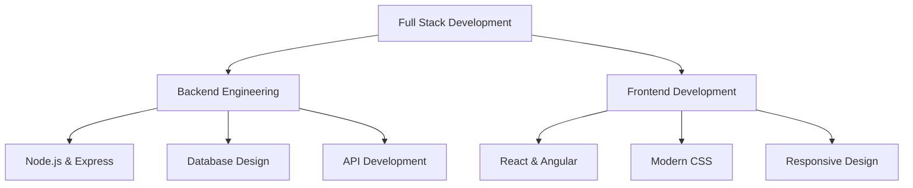

# 

<!-- Animated Header -->

  

---

## 🚀 About Me

- 🔭 I'm currently working on **Node.js, Express, and JavaScript projects**
- 🌱 I'm learning **Angular, System Design & React**
- 👯 I'm looking to collaborate on **Open Source or Hackathon Projects**
- 💬 Ask me about **JavaScript, Node.js, Java, Express**
- 📫 How to reach me **sanket77@gmail.com**
- ⚡ Fun fact **I love debugging and playing chess♟️**

---

## 🛠️ Tech Stack & Tools

### Languages

  
  
  
  
  

### Frontend

  
  
  
  

### Backend

  
  

### Database

  
  

---

## 🎯 Current Focus

---

## 🤝 Connect with Me

---

## 💭 Random Dev Quote

  

---

  
  ### 🌟 "Code is like humor. When you have to explain it, it's bad." - Cory House
  
  
  

---

  

⭐️ From [Sanket77u](https://github.com/Sanket77u)

